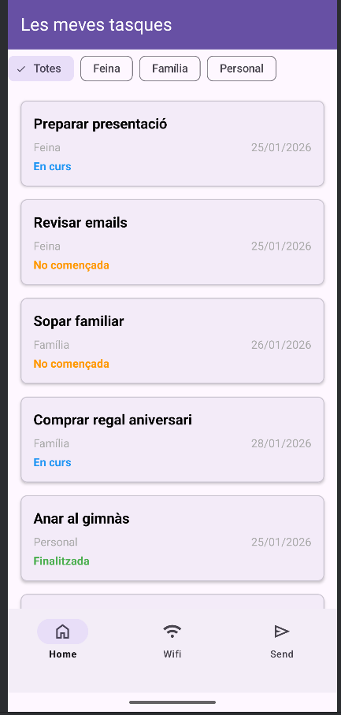
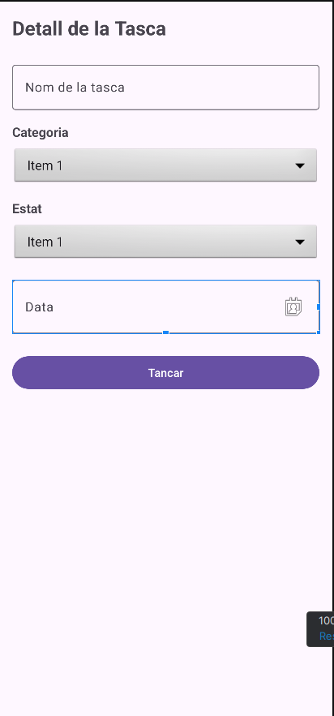
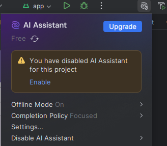

# Resolució exàmen
## Llegeix amb atenció:

A l'arxiu [1a_part.kt](./1a_part.kt) hi ha el resultat (incorrecte en alguns punts) d'un prompt en el que hem demanat una app
amb un llistat de tasques amb categories i estats.
La app carrega en un recycler view una llista de tasques i les diferencía per l'estat.

També incorpora un filtre per l'estat de la tasca i fa alguns efectes visuals.

A l'arxiu [2a_part.kt](./2a_part.kt) hi ha el resultat que ens ha donat la IA per afegir una pantalla per veure el detall de la tasca.

Mostra de com queda:

| Llista de tasques |  Detall tasca |
| ----------------- | ------------- |
|  | |

## Tasques:

- Crea un nou projecte i fes el primer commit.

- Realitza els passos que veuràs a continuació.

- Has d'anar fent commits cada vegada que assoleixis alguna fita (segons el teu criteri), amb una molt breu descripció. Pots fer referència als punts de l'exàmen. 

Cal que facis funcionar la app, amb un resultat semblant a l'indicat.

# Passos

## 0. Desactivar assistent IA a Settings

Gravar la pantalla, i mostrar com es desactiva la IA per aquest projecte
(cal anar al botó de l'esquerra del Build )

## 1. Primera part

Crea  un nou projecte empty views activity a Android Studio

Arxiu: 1a_part.kt

### 1.1. Creació d'arxius necessàris i arreglar primeres fallades evidents. (1 punt)

Separa el codi en arxius, un per cada classe. Soluciona els primers errors. (Fins al punt següent)

### 1.2 Fragment_tasques.xml. (2 punts)
Arregla el layout del fragment_tasques. Falten alguns components i atributs.
    
Aqui la teva aplicació ja hauria de compilar-se

### 1.3 Afegir a la main activity un BottomNavigationView amb 3 opcions (home, wifi, send). (1 punt)
No cal que funcioni, ni que tingui cap comportament. només fés el layout i que es mostri per pantalla

### 1.4. Iniciar el tasquesfragment (1 punt)

El main activity ha de carregar (per codi) el tasquesfragment a l'inici. 

### 1.5 Finalitza la programació del holder:(2 punts)
Acaba les variables necessàries i la funcio de rendritzar que falta del holder.

Posa de color diferent el text "Estat" (vista tvestat) de la tasca en funció de si està
- No començada: Color.parseColor("#FF9800")
- En curs: Color.parseColor("#2196F3")
- Finalitzada: Color.parseColor("#4CAF50")

### 1.5 Adequació del codi i layouts (1 punt)

(S'avaluarà en general la solució)

- L'aplicacio funciona com s'espera.
- Utilitza preferiblement la sintàxi pròpia de kotlin.
- Utilitza el layout més adient en cada cas.
- Els layouts han d'estar correctament dimensionats. Fes atencio a si falten marges, que no se surtin del seu parent, etc.

## 2. Segona part 

Afegeix el codi que veuràs en l'arxiu 2a_part.kt

Fes que en fer click en una tasca del recycler view, es carregui el fragment per veure el detall la tasca.

### 2.1 Modificació del TasquesAdapter (1 punt)
Hauràs de modificar la classe adapter en els llocs necessàris, per passar-li un listener.

### 2.2 Modificació del TasquesFragment (1 punt)
Hauràs de modificar el fragment per afegir el listener.

